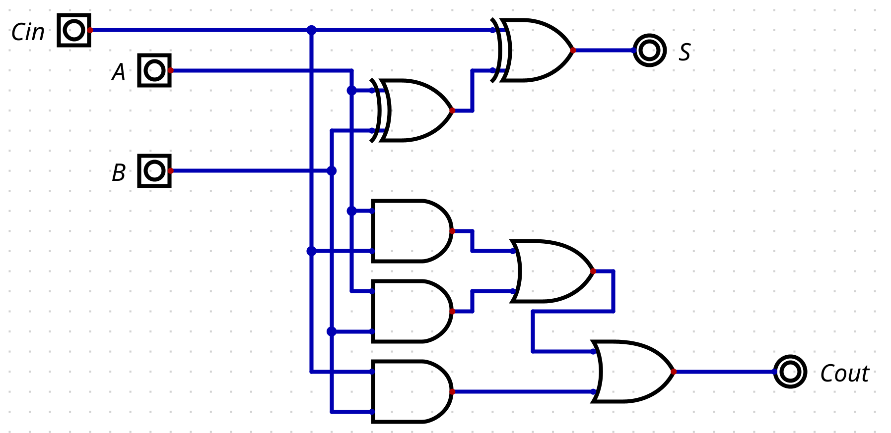
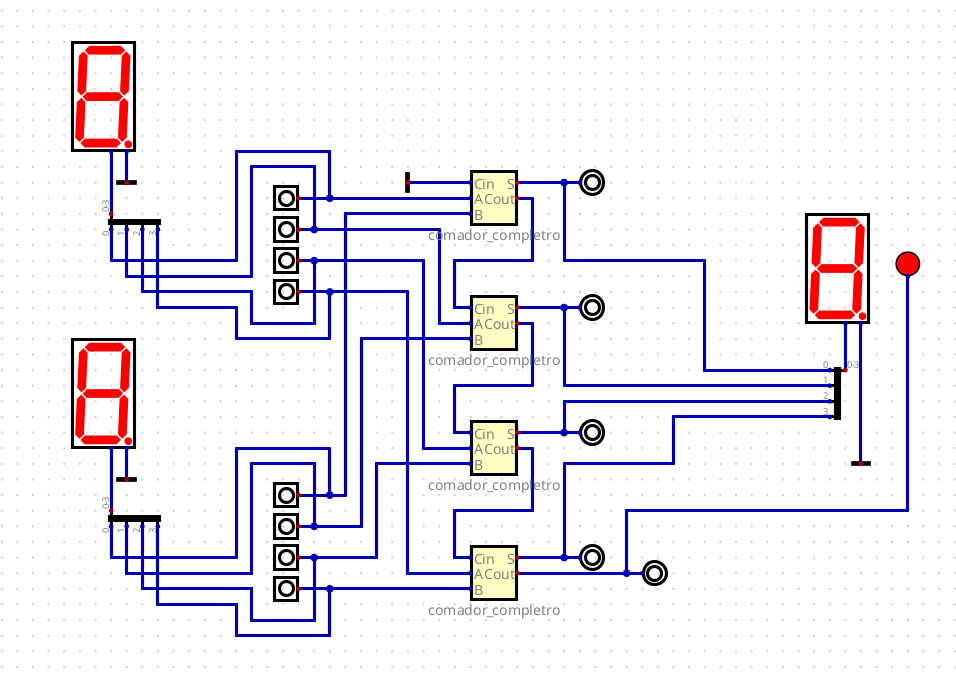

# Ativiade Ponderada

## Somador de 4 bits

&nbsp;&nbsp;&nbsp;&nbsp;Para esta atividade, foi desenvolvido um circuito lógico de um somador de 4 bits.

### Ferramentas

- [Digital](https://github.com/hneemann/Digital).

### Entrega

&nbsp;&nbsp;&nbsp;&nbsp;Primeiramente, foi desenvolvido o circuito de um somador de 1 bit, disponível no arquivo [somador_completo.dig](./circuitos/somador_completo.dig), conforme o que pode ser visto na Figura 1 abaixo.

Figura 1 - Somador de 1 bit

Fonte: Material produzido pela autora (2025)

&nbsp;&nbsp;&nbsp;&nbsp;Para facilitar a montagem de um somador de 4 bits, foi criado um componente com o circuito da Figura 1. Desse modo, no arquivo [somador_final.dig](./circuitos/somador_final.dig) na Fiura 2 abaixo, vê-se a montagem do somador de 4 bits com a utilização do componente somador_completo.

Figura 4 - Somador de 4 bits

Fonte: Material produzido pela autora (2025)

&nbsp;&nbsp;&nbsp;&nbsp;Na Figura 2, faz-se visível também a colocação dos displays para facilitar a leitura dos valores de entrada e de saída. Além disso, há um LED que indica, quando aceso, que houve overflow.

&nbsp;&nbsp;&nbsp;&nbsp;O vídeo disponível no [link](https://drive.google.com/file/d/1tmRRC9bx07AG-woSPUYFrjVOcpy2JSel/view?usp=sharing) contém a demonstração do funcionamento do somador e, em seguida, uma explicação de como ele foi elaborado.
